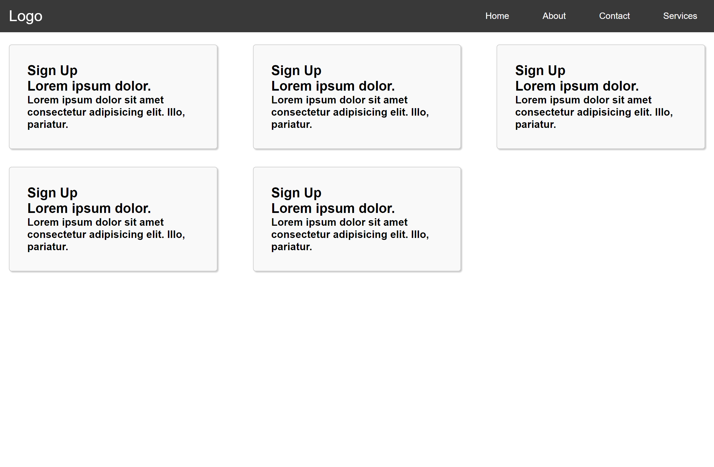
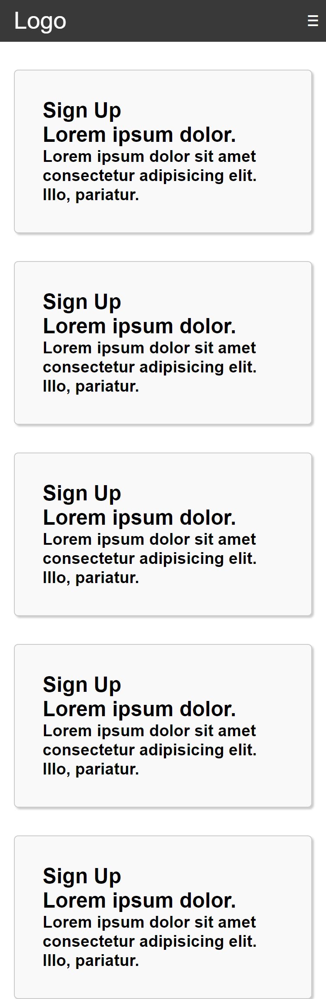

# Navbar Responsive con Icono de Menú Hamburguesa

Este navbar responsive utiliza solo CSS y un ícono de menú de hamburguesa (≡), implementado mediante la etiqueta 

`
<label class="menu-icon" for="menu-btn">&equiv;</label>
`

